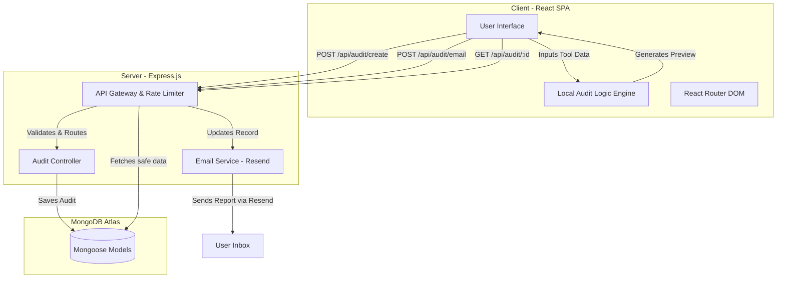

# System Architecture

The AI Spend Audit application is built on a scalable, modern MERN (MongoDB, Express, React, Node.js) stack, prioritizing fast iteration, secure data handling, and seamless frontend-backend integration.

---

## 🏗️ High-Level System Diagram

---

## 📦 Component Breakdown

### 1. Frontend (React + Tailwind CSS)
- **State Management:** Uses React Context and Hooks (`useState`, `useEffect`) to manage the complex, dynamic form inputs.
- **Audit Engine (Client-side):** To ensure a snappy user experience, the initial savings calculations are performed locally in the browser before hitting the database. This allows for instant "what-if" scenarios.
- **Routing:** Handled by `react-router-dom` (v7).

### 2. Backend (Node.js + Express)
- **API Design:** RESTful endpoints nested under `/api/audit/`.
- **Security Middleware:** 
  - `cors` for cross-origin resource sharing.
  - `express-rate-limit` implemented globally to prevent brute-force attacks and abuse of the email endpoint.
- **Production Serving:** In a production environment (`NODE_ENV=production`), Express statically serves the React `build` directory and intercepts all non-API routes to return `index.html`, supporting React Router's SPA routing.

### 3. Database (MongoDB)
- **Schema Design:** The `User` (or Audit) model stores:
  - `shareId`: A short, URL-safe unique identifier generated via `nanoid`.
  - `tools`: An array of tool objects (name, cost, users, usage frequency).
  - `savings`: Pre-calculated savings insights.
  - `email`: (Optional) Captured only if the user requests the full report.

---

## 🔒 Security & Privacy Posture

1. **Anonymous Audits:** Users are not forced to create an account or provide an email to run the audit logic. The system prioritizes immediate value delivery.
2. **Shareable Link Obfuscation:** Database ObjectIDs (`_id`) are never exposed in URLs. Instead, a custom `nanoid` (`shareId`) is used (e.g., `/audit/A1b2C3d`).
3. **Data Stripping:** When a GET request is made to `/api/audit/:id` (typically by someone viewing a shared link), the backend intentionally strips the `email` field from the response payload to protect user privacy.

---

## 🚀 Scalability Considerations

- **Stateless Backend:** The Express backend stores no session state, making it trivial to horizontally scale behind a load balancer.
- **Edge Caching:** Static assets (the React build) can be served entirely via a CDN (like Cloudflare or Vercel Edge Network) to reduce server load.
- **Decoupled Emailing:** Email dispatching (via Resend) is handled asynchronously, ensuring the main thread is not blocked during report generation.
